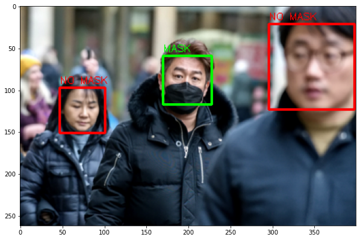
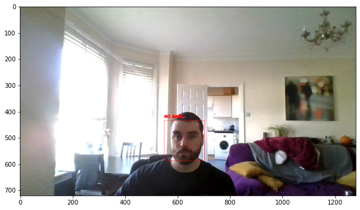
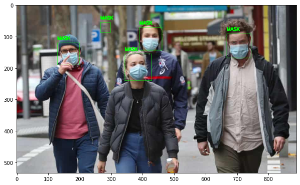
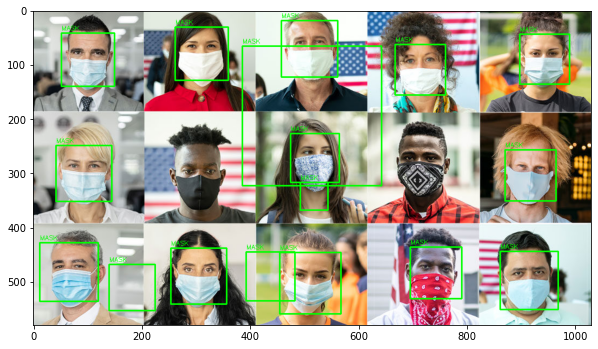
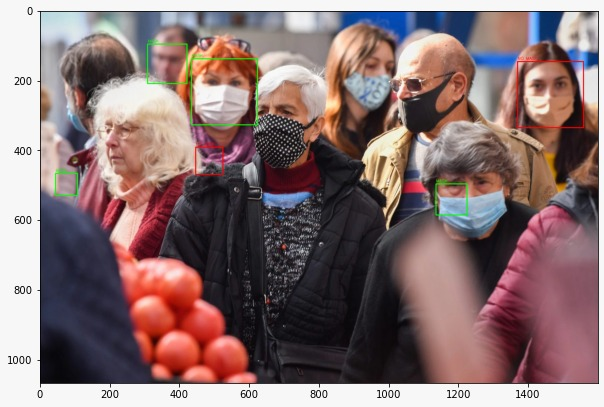
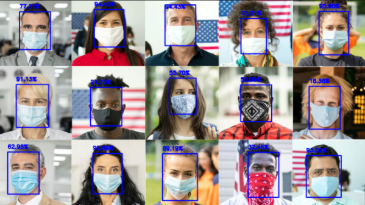
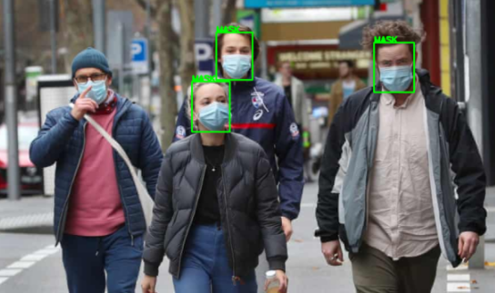
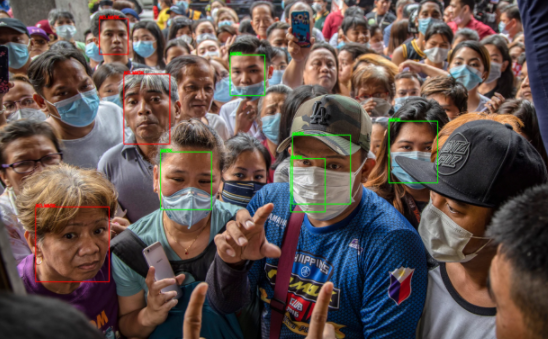

# Facial recognition with Hasscascade and mask detection

This project was designed to take in an image, and apply bounding boxes around any recognized faces. Those bounding boxed images were then cropped and fed into a CNN I trained to identify whether the person or people in the image are wearing a mask or not.

The facial recognition utilizes CV2 library to identify bounding boxes.
The Convolution Neural Network uses pre-trained ImageNet weights, with an additional flatten, dense and output layer added for weight training.

The training notebook for the CNN can be found [here](https://github.com/danielbsimpson/Mask-Recognition-using-CNN-and-Transfer-Learning).

The final output is the same image, with bounding boxes around the faces that are green if the individual is wearing a mask, or red if the individual is not wearing a mask.

I first tested this notebook using my webcam on my laptop:

Then I went on to identify some various test cases

## Mutliple individuals in an image all wearing masks:

Clearly there are some issues to be worked out. In the images above, the first image has identified a face where non exists. In the second image it is failing to identify those with darker skin complexion. I would image this is due to the training set for the CV2 model. As I did not train the model and instead just used what was avaiable from Intel, I did not go back to adjust the algorithm to account for this.

## Multiple individuals in an image, some wearing masks:

The facial recognition is failing to identify some individual faces in the image, most likely due to the faces not looking straight on. It seems to have missed individuals who are showing more of a side profile. Also it can be seen that in the first image, the lady in the back is wearing a mask that is close to skin tone, and the CNN mis-classified this individual. Possibly adding more colored images where the mask is close to skin tone, during training of the CNN, could resolve this issue.

## Facial recognition with Caffe and mask detection

Applying the same logic I applied the Deep Learning Network provided by CV2 for facial recognition, the Caffe model. The threshold value can be tuned in this model to allow for more faces being recognized, but could possibly result in more false positives for faces detected in an image.
Since I was having issues with Hasscascade I decided to give this model a shot for detection, and then once again fed the cropped image into the mask detector.

This project could easily be applied frame by frame to video images to give real time mask/no mask identification of individuals on a property.

Thanks for reading!
